**期中实验**

刚开始导入项目的时候出现了很多错误，如下：

Gradle sync failed: Don't know how to build models for org.gradle.tooling.internal.gradle.DefaultGradleBuild@60c450a2

这是因为tool和gradle版本和本机不相同导致的，然后我将版本换成本机的版本，出现以下错误：

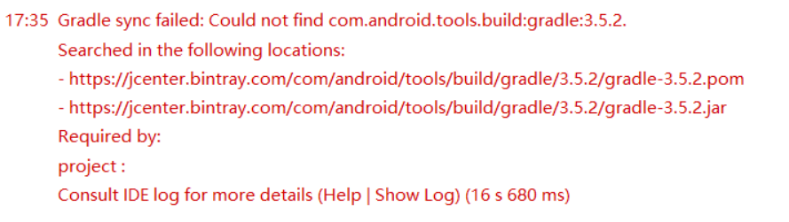

这里调试了很久，最后在百度上找到一篇解决办法：

解决方法为在 allprojects 字段中增加 google() 源服务器。

修改后的配置变更如下：

buildscript {
repositories {
google()
jcenter()
}
dependencies {
classpath ‘com.android.tools.build:gradle:3.6.1’
// NOTE: Do not place your application dependencies here; they belong
// in the individual module build.gradle files
} } allprojects {
repositories {
google()
jcenter()
} }
原文链接：https://blog.csdn.net/h1031171995/article/details/105174175/

然后我就成功编译了，如下：

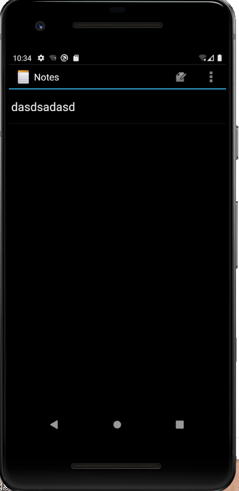


**笔记列表显示笔记条目的修改时间（时间戳）**

其实notepad已经有记录日期了只是没有显示出来，我们要做的就是让它显示出来

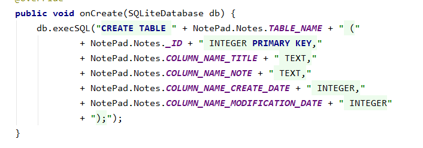

首先在notelist_item.xml中添加一个textview，让我们可以看得到时间戳

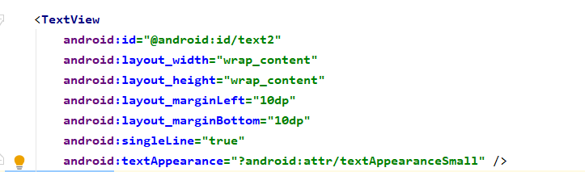

然后在NoteEditor.java中的updateNote函数和NotePadProvider中的insert函数中添加转化时间的函数

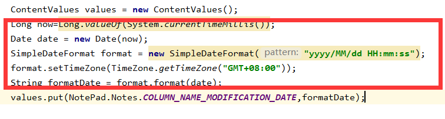

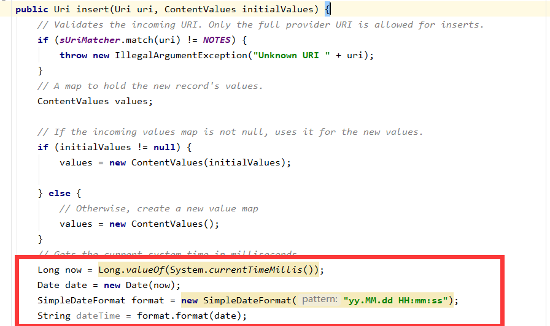

最后在NoteList.java中的显示Note的函数中加上时间显示

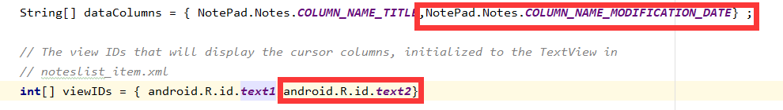

运行后就会出现以下结果

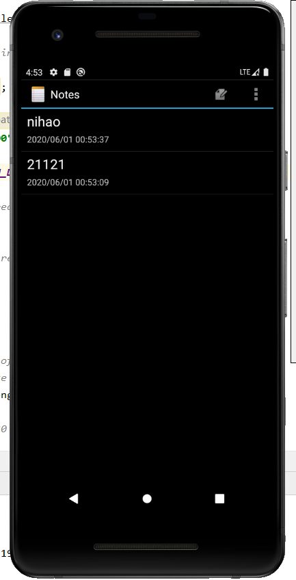


假设没有上面的转化函数的操作，时间会出现乱码，如下

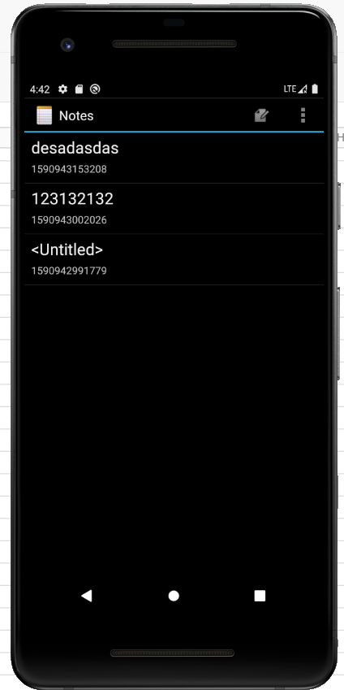


**查询功能**

首先在notelist_item.xml中创建一个搜索框

```
<SearchView    
android:id="@+id/search_view"    
android:layout_width="match_parent"    
android:layout_height="wrap_content"    
android:iconifiedByDefault="false"    
/>
<ListView    
android:id="@+id/list_view"    
android:layout_width="match_parent"    
android:layout_height="wrap_content"    
/>
```

接着在菜单栏java文件的switch选择中，添加查找功能的case

```
case R.id.menu_search:
            /*
                查找功能
             */
            Intent intent = new Intent(this, NoteSearch.class);
            this.startActivity(intent);
            return true;
```

然后在NoteSearch.java里完成查找功能的实现

```
public boolean onQueryTextChange(String string) {
    String selection1 = NotePad.Notes.COLUMN_NAME_TITLE+" like ? or "+NotePad.Notes.COLUMN_NAME_NOTE+" like ?";
    String[] selection2 = {"%"+string+"%","%"+string+"%"};
    Cursor cursor = sqLiteDatabase.query(
                NotePad.Notes.TABLE_NAME,
                PROJECTION, // The columns to return from the query
                selection1, // The columns for the where clause
                selection2, // The values for the where clause
                null,          // don't group the rows
                null,          // don't filter by row groups
                NotePad.Notes.DEFAULT_SORT_ORDER // The sort order
        );

```

剩下的显示功能，用原来NoteList的显示代码即可完成

```
// The names of the cursor columns to display in the view, initialized to the title column
        String[] dataColumns = {
                NotePad.Notes.COLUMN_NAME_TITLE,
                NotePad.Notes.COLUMN_NAME_MODIFICATION_DATE
        } ;
        // The view IDs that will display the cursor columns, initialized to the TextView in
        // noteslist_item.xml
        int[] viewIDs = {
                android.R.id.text1,
                R.id.text1_date
        };
        // Creates the backing adapter for the ListView.
        SimpleCursorAdapter adapter
                = new SimpleCursorAdapter(
                this,                             // The Context for the ListView
                R.layout.noteslist_item,         // Points to the XML for a list item
                cursor,                           // The cursor to get items from
                dataColumns,
                viewIDs
        );
        // Sets the ListView's adapter to be the cursor adapter that was just created.
        listView.setAdapter(adapter);
        return true;
     }

```

```
ListView listView;
    SQLiteDatabase sqLiteDatabase;
    /**
     * The columns needed by the cursor adapter
     */
    private static final String[] PROJECTION = new String[]{
            NotePad.Notes._ID, // 0
            NotePad.Notes.COLUMN_NAME_TITLE, // 1
            NotePad.Notes.COLUMN_NAME_MODIFICATION_DATE//时间
    };
    @Override
    protected void onCreate(Bundle savedInstanceState) {
        super.onCreate(savedInstanceState);
        setContentView(R.layout.note_search);
        SearchView searchView = findViewById(R.id.search_view);
        Intent intent = getIntent();
        if (intent.getData() == null) {
            intent.setData(NotePad.Notes.CONTENT_URI);
        }
        listView = findViewById(R.id.list_view);
        sqLiteDatabase = new NotePadProvider.DatabaseHelper(this).getReadableDatabase();
        searchView.setOnQueryTextListener(this);
    }
```

最终得到结果如下：

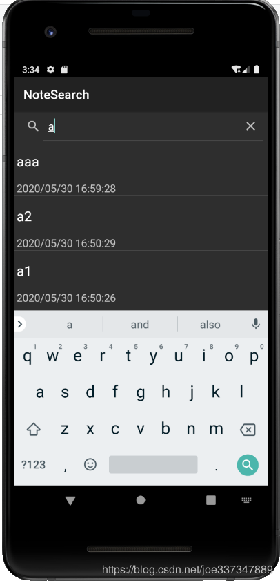

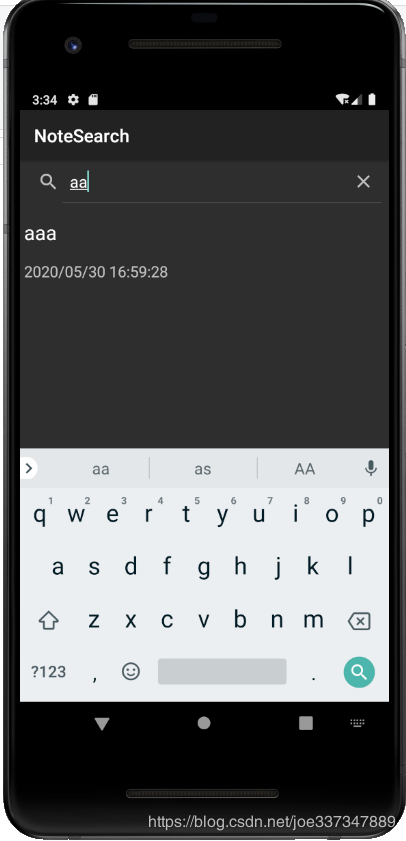