## 实验一


实验二

## 1.安装Apache Web服务器

使用yum工具安装：

sudo yum install httpd

sudo命令获得了root用户的执行权限，因此需要验证用户口令。
安装完成之后，启动Apache Web服务器：

sudo systemctl start httpd.service


测试Apache服务器是否成功运行，找到腾讯云实例的公有IP地址(your_cvm_ip)，在你本地主机的浏览器上输入：

```
http://your_cvm_ip/
```

若运行正常，将出现如下界面：


## 2.安装MySQL

CentOS 7.2的yum源中并末包含MySQL，需要其他方式手动安装。因此，我们采用MySQL数据库的开源分支MariaDB作为替代。
安装MariaDB：

```
sudo yum install mariadb-server mariadb
```


安装好之后，启动mariadb：

```
sudo systemctl start mariadb
```


随后，运行简单的安全脚本以移除潜在的安全风险，启动交互脚本：

sudo mysql_secure_installation
1
设置相应的root访问密码以及相关的设置(都选择Y)。
最后设置开机启动MariaDB：

sudo systemctl enable mariadb.service


3.安装PHP
PHP是一种网页开发语言，能够运行脚本，连接MySQL数据库，并显示动态网页内容。
默认的PHP版本太低（PHP 5.4.16），无法支持最新的WordPress（笔者写作时为5.2.2），因此需要手动安装PHP较新的版本(PHP 7.2)。
PHP 7.x包在许多仓库中都包含，这里我们使用Remi仓库，而Remi仓库依赖于EPEL仓库，因此首先启用这两个仓库

sudo yum install epel-release yum-utils
sudo yum install http://rpms.remirepo.net/enterprise/remi-release-7.rpm


接着启用PHP 7.2 Remi仓库：

sudo yum-config-manager --enable remi-php72


安装PHP以及php-mysql

sudo yum install php php-mysql


查看安装的php版本：

php -v


安装之后，重启Apache服务器以支持PHP：

sudo systemctl restart httpd.service


### 安装PHP模块

为了更好的运行PHP，需要启动PHP附加模块，使用如下命令可以查看可用模块：

```
yum search php-
```


这里先行安装php-fpm(PHP FastCGI Process Manager)和php-gd(A module for PHP applications for using the gd graphics library)，WordPress使用php-gd进行图片的缩放。

sudo yum install php-fpm php-gd


重启Apache服务：

sudo service httpd restart


至此，LAMP环境已经安装成功，接下来测试PHP。


4.测试PHP
这里我们利用一个简单的信息显示页面（info.php）测试PHP。创建info.php并将其置于Web服务的根目录（/var/www/html/）：

sudo vim /var/www/html/info.php


该命令使用vim在/var/www/html/处创建一个空白文件info.php，我们添加如下内容：


<?php phpinfo(); ?>
完成之后，使用刚才获取的cvm的IP地址，在你的本地主机的浏览器中输入:

http://your_cvm_ip/info.php


## 5.安装WordPress以及完成相关配置

### (1)为WordPress创建一个MySQL数据库

首先以root用户登录MySQL数据库：

```
mysql -u root -p
```


首先为WordPress创建一个新的数据库：

CREATE DATABASE wordpress;


注意：MySQL的语句都以分号结尾。
接着为WordPress创建一个独立的MySQL用户：

CREATE USER wordpressuser@localhost IDENTIFIED BY 'password';


“wordpressuser”和“password”使用你自定义的用户名和密码。授权给wordpressuser用户访问数据库的权限：


GRANT ALL PRIVILEGES ON wordpress.* TO wordpressuser@localhost IDENTIFIED BY 'password';
随后刷新MySQL的权限：

FLUSH PRIVILEGES;


最后，退出MySQL的命

令行模式：

exit


(2)安装WordPress
下载WordPress至当前用户的主目录：

cd ~
wget http://wordpress.org/latest.tar.gz

wget命令从WordPress官方网站下载最新的WordPress集成压缩包，解压该文件：

tar xzvf latest.tar.gz

解压之后在主目录下产生一个wordpress文件夹。我们将该文件夹下的内容同步到Apache服务器的根目录下，使得wordpress的内容能够被访问。这里使用rsync命令：

sudo rsync -avP ~/wordpress/ /var/www/html/


接着在Apache服务器目录下为wordpress创建一个文件夹来保存上传的文件：

mkdir /var/www/html/wp-content/uploads


对Apache服务器的目录以及wordpress相关文件夹设置访问权限：

sudo chown -R apache:apache /var/www/html/*


这样Apache Web服务器能够创建、更改WordPress相关文件，同时我们也能够上传文件。

(3)配置WordPress
大多数的WordPress配置可以通过其Web页面完成，但首先通过命令行连接WordPress和MySQL。
定位到wordpress所在文件夹：

cd /var/www/html

WordPress的配置依赖于wp-config.php文件，当前该文件夹下并没有该文件，我们通过拷贝wp-config-sample.php文件来生成：

cp wp-config-sample.php wp-config.php


然后，通过nano超简单文本编辑器来修改配置，主要是MySQL相关配置：

nano wp-config.php


### (4)通过Web界面进一步配置WordPress

经过上述的安装和配置，WordPress运行的相关组件已经就绪，接下来通过WordPress提供的Web页面进一步配置。输入你的IP地址或者域名：

```
http://server_domain_name_or_IP
```

出现如下界面：


设置网站的标题，用户名和密码以及电子邮件等，点击**Install WordPress**，弹出确认页面：


点击**Log In**，弹出登录界面：


输入用户名和密码之后，进入WordPress的控制面板：


实验三

使用如下命令查看操作系统内核信息：

uname -r

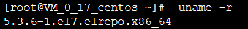

顺带看一下Linux的版本号：

```
cat /etc/redhat-release
```

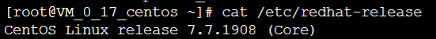

**安装Docker**

CentOS 7的应用程序库可能不是最新的，因此首先更新应用程序数据库：

sudo yum check-update


接下来添加Docker的官方仓库，下载最新的Docker并安装：

```
curl -fsSL https://get.docker.com/ | sh
```

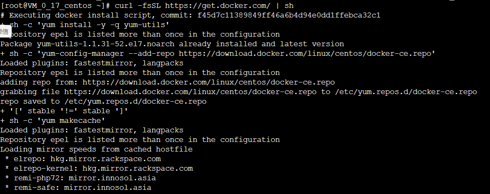

安装完成之后启动Docker守护进程，即Docker服务：

sudo systemctl start docker

验证Docker是否成功启动：

sudo systemctl status docker

得到类似如下图的输出：

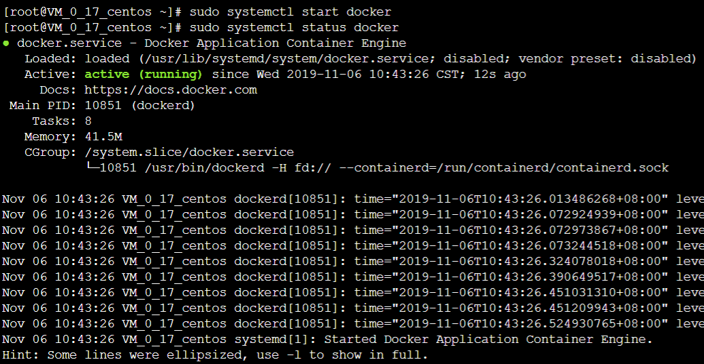

最后，确保Docker当服务器启动时自启动：

```
sudo systemctl enable docker

```

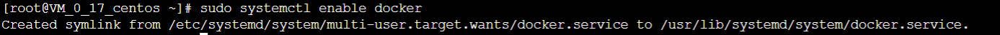

此外，还可以查看一下Docker的版本信息：

```
docker version
```

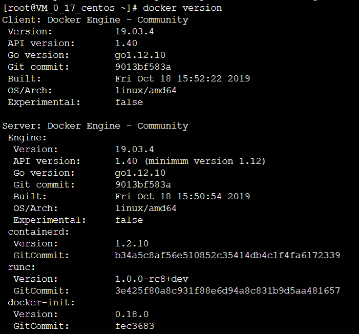

# Docker基本操作

查看docker所有的命令，键入：

docker

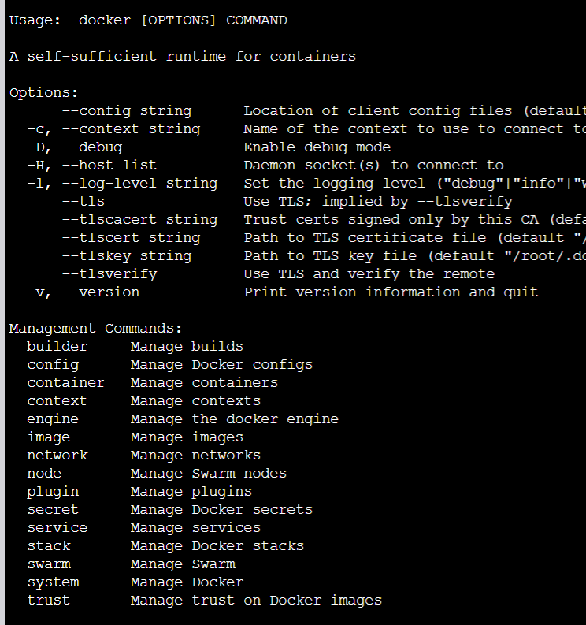

查看当前系统docker的相关信息：

docker info

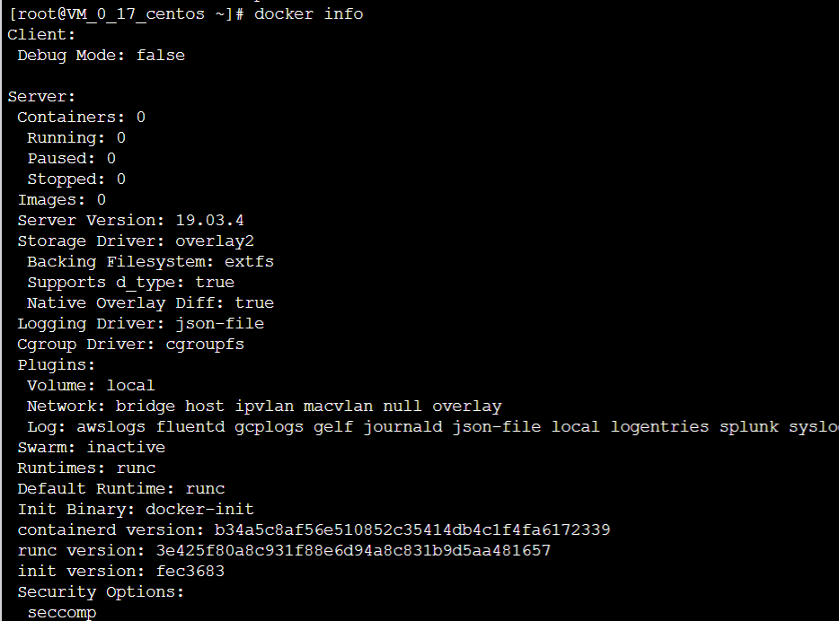

## 加载Docker镜像

Docker镜像是容器运行的基础，默认情况下，将从Docker Hub拉取镜像。首先使用search命令查询Docker Hub中的可用镜像，这里以查询可用的CentOS镜像为例：

docker search centos

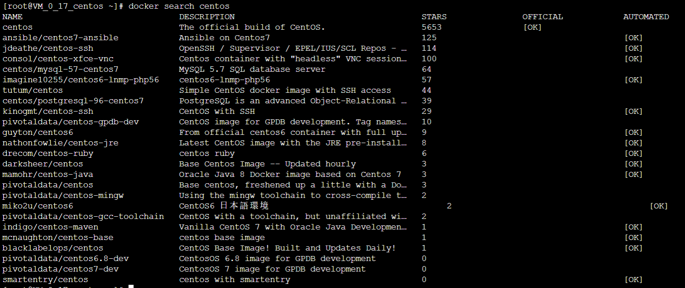

接下来拉取官方版本(OFFICIAL)的镜像：

docker pull centos：7


一旦镜像下载完成，可以基于该镜像运行容器，使用run命令：

docker run centos

查看一下当前系统中存在的镜像：

docker images

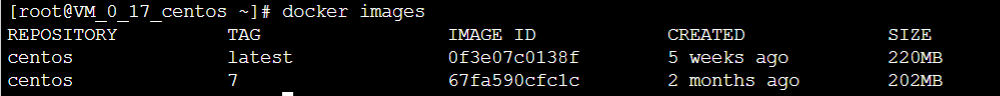

 

## 运行Docker容器

以上述的CentOS镜像为例运行其容器，使用-it参数进入交互shell模式：

docker run -it centos

进行container内部shell，如下图所示：

## 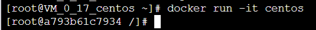

## 创建新的镜像

在前序操作的基础上，本小节将创建新的镜像，即提交更改到新的镜像。首先从容器的交互shell退出并保存状态，使用exit命令

exit

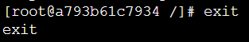

我们首先使用如下命令查看本地中的容器：

docker ps -a

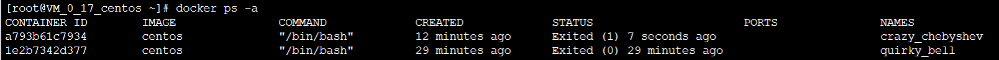

现在使用commit命令来提交更改到新的镜像中，即创建新的镜像。命令格式

docker commit [OPTIONS] CONTAINER [REPOSITORY[:TAG]]

这种提交类似于git协议的提交，同样这里提交的镜像只保存在本地。后续可以提交到远程镜像仓库，比如Docker Hub。
 再次使用镜像查看命令：

docker images

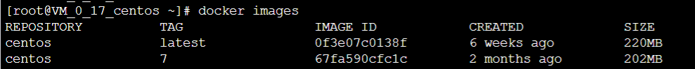

运行Docker容器（为了方便检测后续wordpress搭建是否成功，需设置端口映射（-p），将容器端口80 映射到主机端口8888，Apache和MySQL需要 systemctl 管理服务启动，需要加上参数 –privileged 来增加权，并且不能使用默认的bash，换成 init，否则会提示 Failed to get D-Bus connection: Operation not permitted ，-name 容器名 ，命令如下 ）

docker run -d -it --privileged --name wordpress -p 8888:80 -d centos:7 /usr/sbin/init

查看已启动的容器

docker ps

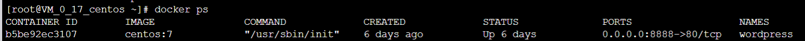

进入容器前台：

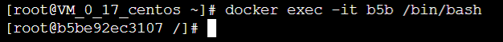

开始安装WordPress：

安装Apache Web服务器

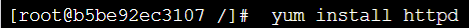

安装成功：

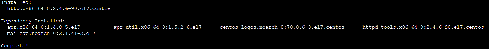

*安装完成后，启动**Apache Web**服务器：*

*设置开机自启：*

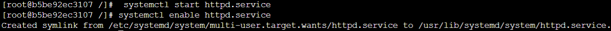

访问公网ip(加上端口:8888)：

### 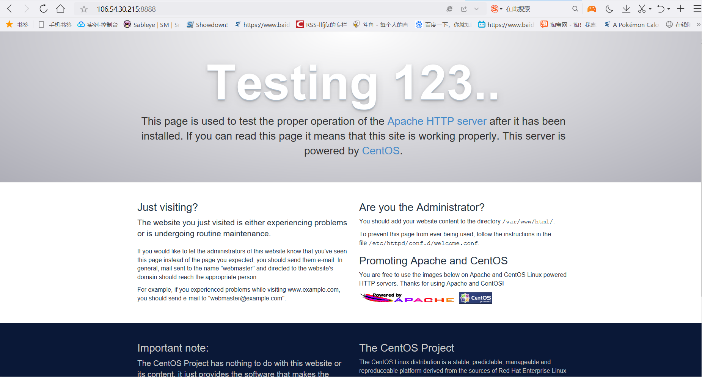安装MySQL

*安装MariaDB*

```
yum install mariadb-server mariadb

安装成功：

```

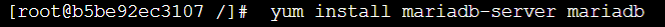

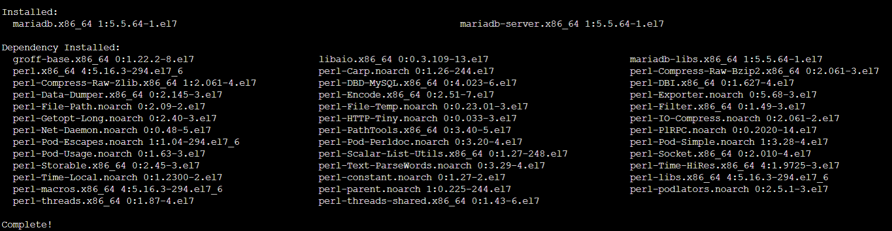

启动MariaDB*

```
systemctl start mariadb

```

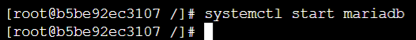

设置MySQL的root密码*

```
mysql_secure_installation

```

初始密码为空，提示输入正确密码，直接回车，再设置密码，其他选择Y

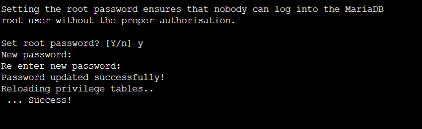

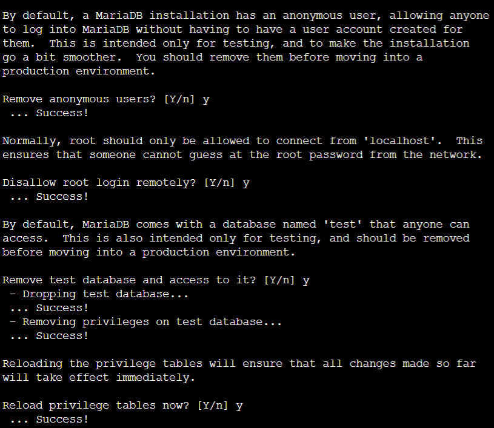

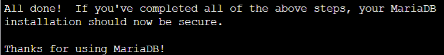

*设置开机自启MariaDB*

```
systemctl enable mariadb.service
```

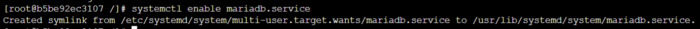

### 安装PHP

```
yum install epel-release yum-utils


yum install http://rpms.remirepo.net/enterprise/remi-release-7.rpm


```

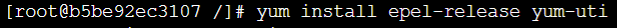

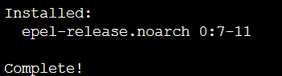

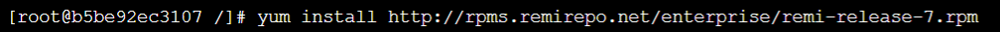


因为WordPress需要php5.6以上版本的支持，我们更新到7.2版本仓库*

```
yum-config-manager --enable remi-php72


```

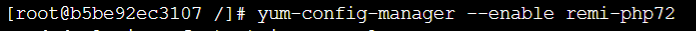

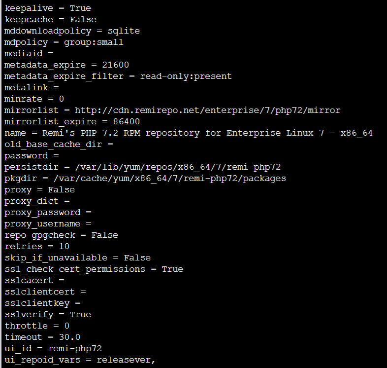


安装PHP以及php-mysql*

```
yum install php php-mysql

安装成功：

```

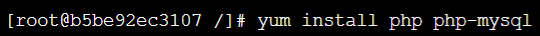

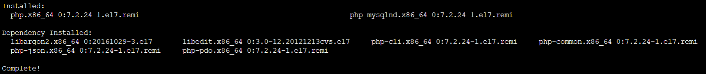

查看安装的php版本*

```
php -v

```

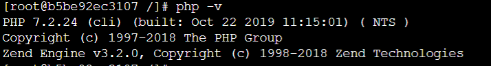

重启Apache服务器以支持PHP*

```
systemctl restart httpd.service

```

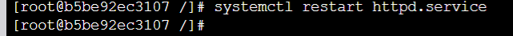

为了更好的运行PHP，需要启动PHP附加模块*

```
yum install php-fpm php-gd

安装成功:

```

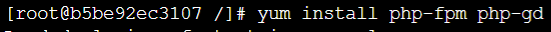

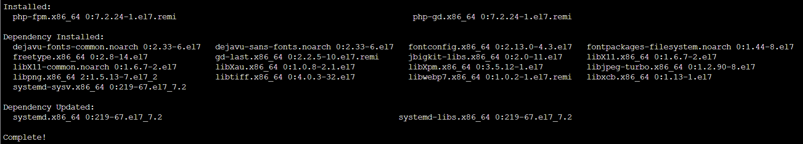

重启Apache服务*

```
systemctl restart httpd.service
```

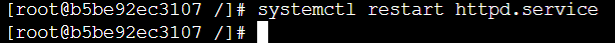

### 安装WordPress以及完成相关配置

*登录数据库*

```
mysql -u root -p
```

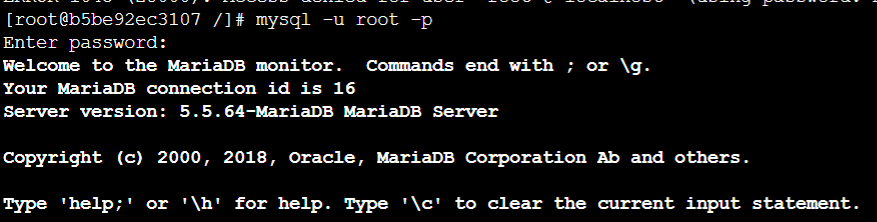

*为WordPress创建一个新的数据库*

```
CREATE DATABASE 数据库名 ;
```

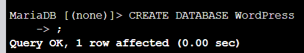

*进入刚创建的数据库*

```
use 数据库名 ;
```

为WordPress创建一个独立的MySQL用户并授权给数据库访问权限*

```
CREATE USER 用户名@localhost IDENTIFIED BY '密码';

GRANT ALL PRIVILEGES ON WordPress.* TO zkj@localhost IDENTIFIED BY '123456';

```

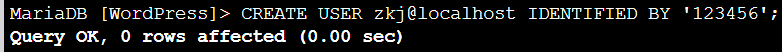

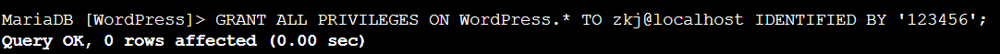

刷新MySQL的权限*

```
FLUSH PRIVILEGES;
```

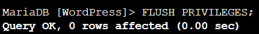

*安装WordPress*

```
git clone https://gitee.com/helang_z/wordpress.git
```

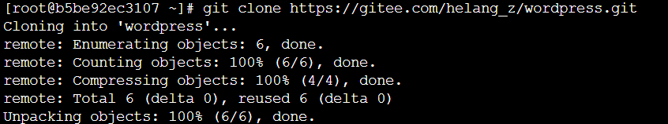

sudo rsync -avP ~/wordpress/ /var/www/html/

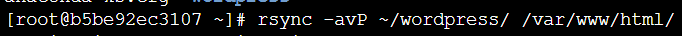

mkdir /var/www/html/wp-content/uploads

sudo chown -R apache:apache /var/www/html/*

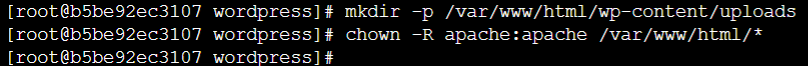

 

配置WordPress

大多数的WordPress配置可以通过其Web页面完成，但首先通过命令行连接WordPress和MySQL。

定位到wordpress所在文件夹：

cd /var/www/html

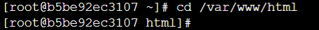

WordPress的配置依赖于wp-config.php文件，当前该文件夹下并没有该文件，我们通过拷贝wp-config-sample.php文件来生成：

cp wp-config-sample.php wp-config.php

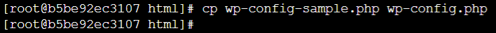

然后，通过vi wp-config.php，主要是MySQL相关配置：

vi wp-config.php

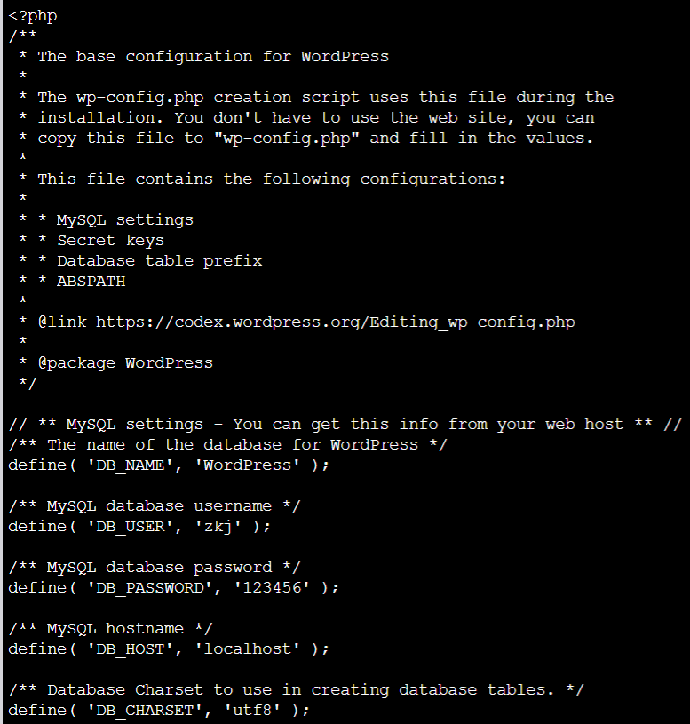

输入自己的公网ip加端口：http://106.54.30.215:8888/

出现以下画面：


成功进入WordPress：

